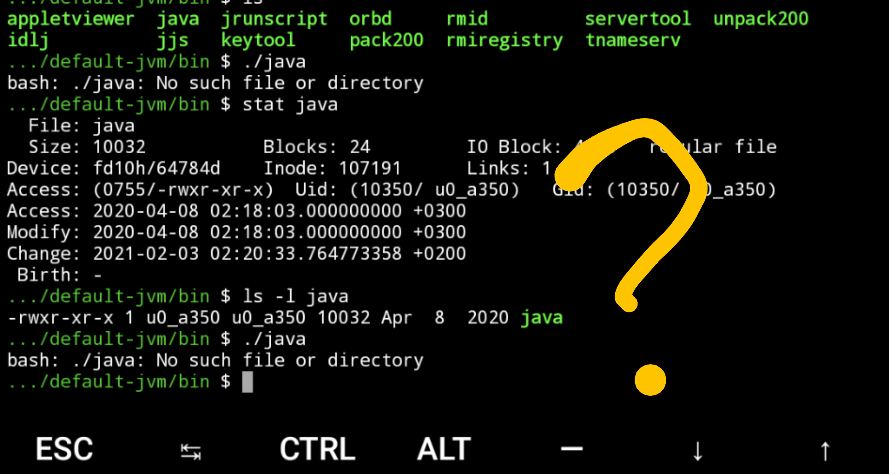

The environment setup in Termux is similar to that of a modern Linux
distribution. However, running on Android implies several important
differences.

## Termux is not FHS compliant

*This is why Termux does not use official Debian or Ubuntu packages for
its environment.*

Termux does not follow [Filesystem Hierarchy
Standard](https://en.wikipedia.org/wiki/Filesystem_Hierarchy_Standard)
unlike majority of Linux distributions. You cannot find directories like
/bin, /etc, /usr, /tmp and others at the usual locations. Thus, all
programs must be patched and recompiled to meet requirements of the
Termux environment otherwise they will not be able to find their
configuration files or other data.

You may have a problem executing scripts that have standard shebangs
(e.g. \#!/bin/sh). Use the `termux-fix-shebang` script to modify these
files before executing. Recent versions of Termux provide a special
package (termux-exec) which allows usage of standard she-bangs.

Most packages have shared library dependencies which are installed to
\$PREFIX/lib. On devices before Android 7, Termux exports the special
variable \$LD_LIBRARY_PATH which tells the linker where to find shared
library files. On Android 7 or higher, the DT_RUNPATH ELF header
attribute is used instead of LD_LIBRARY_PATH.

If you still need a classical Linux file system layout for some reason,
you may try to use **termux-chroot** from package 'proot':

`$ pkg install proot`
`$ termux-chroot`
`$ ls /usr`
`bin  doc  etc  include lib  libexec  share  tmp  var`

The **termux-chroot** utility may be very helpful if you use custom
software that requires standard paths like /tmp, /etc, /usr to be
available.

## Termux uses Bionic libc

To have the best compatibility with Android OS and to remove the need to
maintain custom toolchains we compile all our packages with the Android
NDK. The resulting binaries are linked against the Bionic libc (files
libc.so, libm.so, libdl.so from /system/lib or /system/lib64).

Use of the libc provided by Android and FHS incompatibility make it
impossible to execute native packages copied from Linux distributions:

- Dynamically linked programs will not run because the linker is
  expected in a nonexistent location (/lib) and libc ABI does not match.
- Statically linked programs (only networking ones) will not be able to
  resolve DNS names. GNU libc normally doesn't allow static linking with
  resolver. Also, the file /etc/resolv.conf does not exist on Android.
- On non-rooted Android 8 or newer, statically linked programs will not
  run due to issues with seccomp filter.
- See also: [Common porting
  problems](https://github.com/termux/termux-packages/wiki/Common-porting-problems)

However, these restrictions can be bypassed by setting up a Linux
distribution rootfs with [PRoot](PRoot).

## Root file system is stored as ordinary application data

The root file system and user home directory are located in a private
application data directory which lives on the /data partition. Paths to
these directories are exposed as \$PREFIX and \$HOME respectively.

You cannot move \$PREFIX to another location because all programs expect
that \$PREFIX will not be changed. Additionally, you cannot have
binaries, symlinks and other files from \$PREFIX on sdcard because that
file system does not support unix permissions, symlinks, sockets, etc...

**Important**: if you uninstall the Termux application or wipe its data,
directories \$PREFIX and \$HOME will be wiped too. Before doing this,
make sure that all important data is backed up.

## Termux is single-user

Android applications are sandboxed and have their own Linux user id and
SELinux label. Termux is no exception and everything within Termux is
executed with the same user id as the Termux application itself. The
username may look like `u0_a231` and cannot be changed as it is derived
from the user id by Bionic libc.

All our packages (except root-only ones) are patched to drop any
multiuser, setuid/setgid and other similar functionality. We also
changed default ports for server packages: ftpd, httpd and sshd have
their default ports set to 8021, 8080 and 8022 respectively.

You have free read-write access to all application components including
\$PREFIX. Be careful since it is very easy to break things by
accidentally deleting or overwriting files in \$PREFIX.

# See Also

- [Running Linux operating systems in Termux PRoot](PRoot)
- [Sharing data between Termux and other
  applications](Sharing_Data)
- [Termux-exec](Termux-exec)
- [Common porting
  problems](https://github.com/termux/termux-packages/wiki/Common-porting-problems)