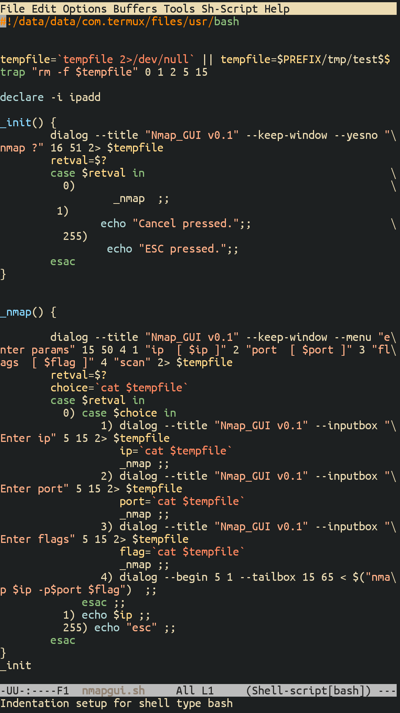
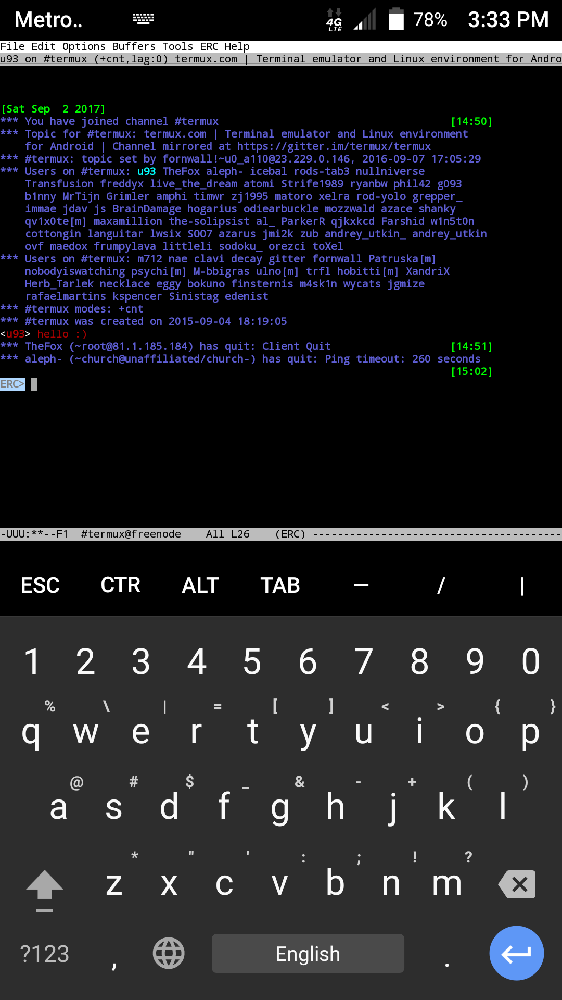
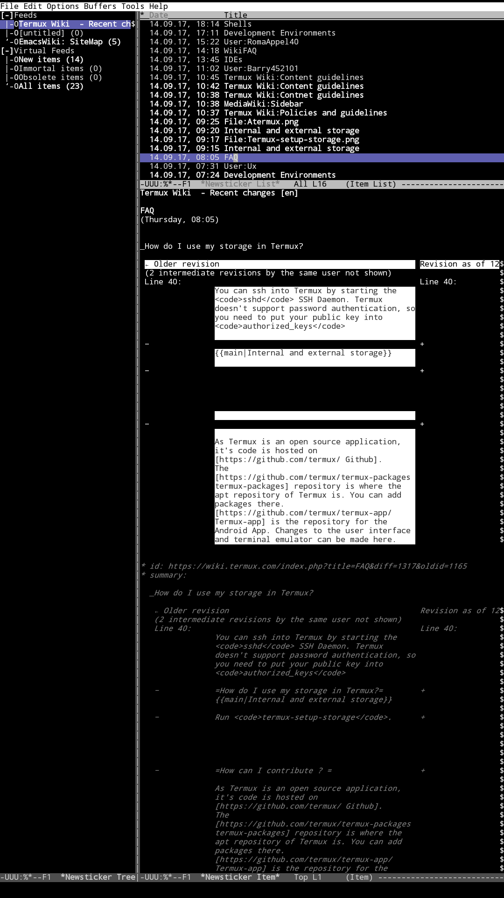

Package: emacs

Description: An extensible, customizable, free/libre text editor — and
more.

Homepage: <https://www.gnu.org/software/emacs/>

# ERC

ERC is a powerful, modular, and extensible IRC client for Emacs. It is
distributed with Emacs since version 22.1. To use ERC type the following
in `emacs`: `M-x erc` +enter/return. `M-x` means `ALT+x` in Termux. Use
“irc.libera.chat” as the IRC server, “6697” as the port, choose a
nickname Just tap enter. Type `/join #termux` and presto, you can chat
on \#termux from emacs in your pocket. More at
<https://www.emacswiki.org/emacs/ERC>

# Newsticker

- [Newsticker](Newsticker) provides a Feed Reader for Emacs.

## See also

- [ERC
  Manual](https://www.gnu.org/software/emacs/manual/html_mono/erc.html)
- [IDE](IDE)
- [IRC](IRC)