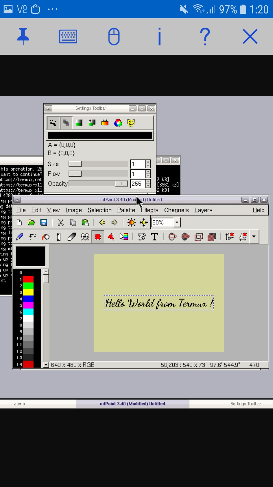
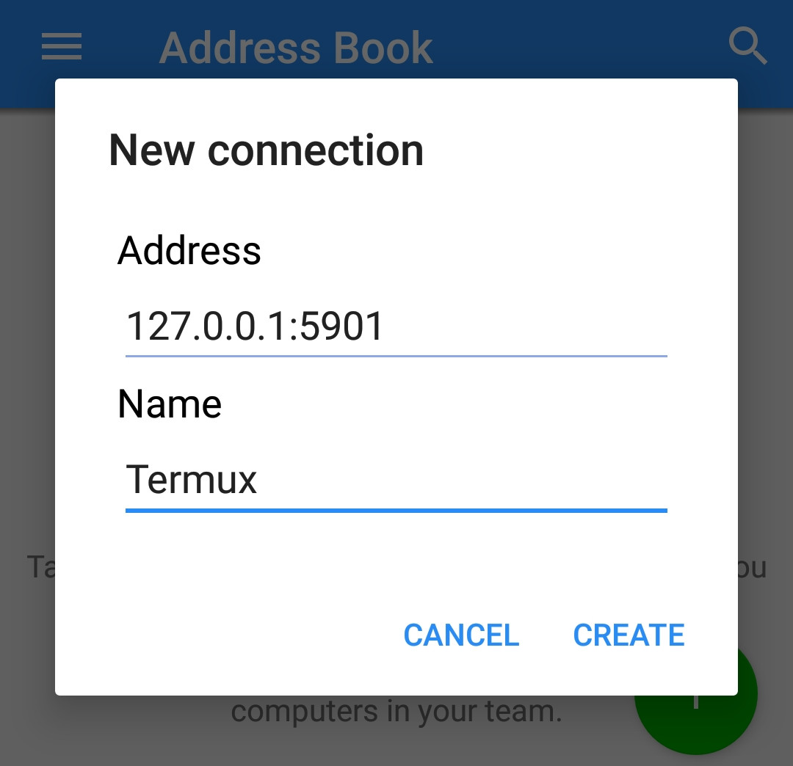
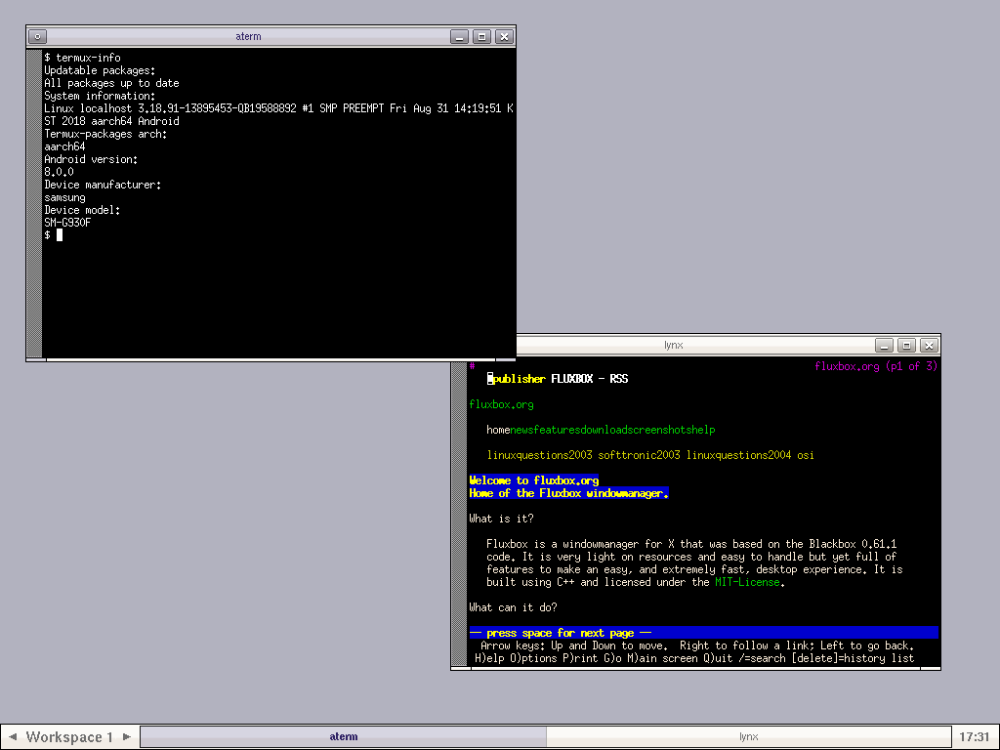
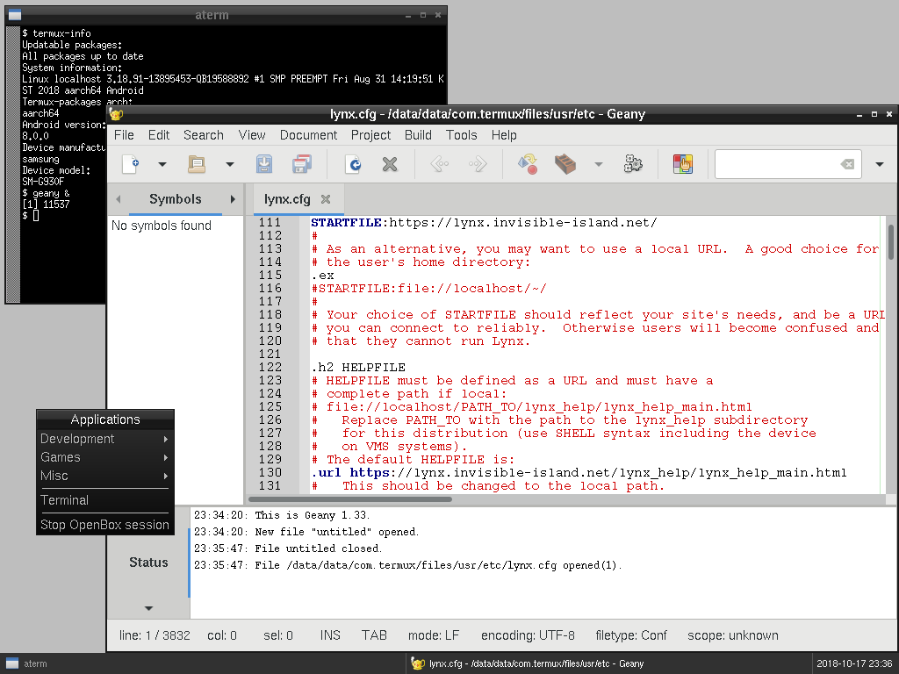
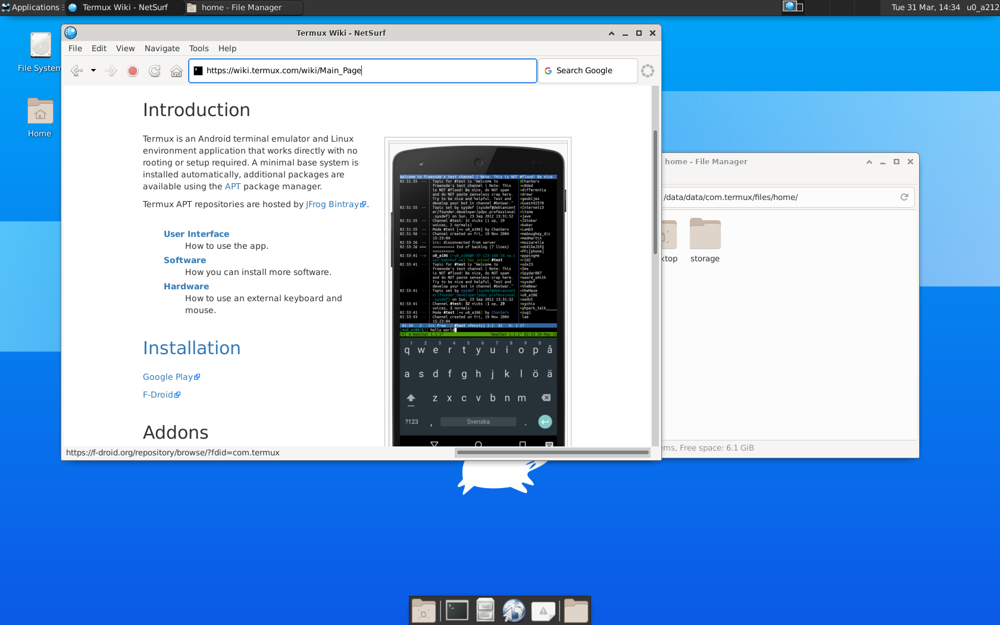

**This article is only applicable only to Termux installations running
on Android 7.0 or higher.**

Termux provides support for programs that use X Window System. However,
there no hardware acceleration for rendering and user will have to
install a third party application to view graphical output.

 To
use X11-enabled programs, please, make sure that at least one of the
following programs is installed:

- [VNC
  Viewer](https://play.google.com/store/apps/details?id=com.realvnc.viewer.android) -
  the best choice for interacting with graphical environment. Requires a
  running VNC server.

<!-- -->

- [XServer
  XSDL](https://play.google.com/store/apps/details?id=x.org.server) -
  this one may be unstable but it provides a standalone Xorg server so
  you don't have to setup VNC.

<!-- -->

- [Android XServer](https://github.com/nwrkbiz/android-xserver) - Only
  implements the core X11 protocol. Shares clipboard between android /
  X11 and includes a window manager.

## Enabling the X11 Repository

X11 packages are available in a **separate** APT repository. You can
enable it by running the following command:

`pkg install x11-repo`

It will automatically add appropriate sources.list file and PGP key.

To disable this repository, you need to uninstall package `x11-repo`.

## Setting up VNC

### Server

If you decided to use VNC for graphical output, follow these
instructions for properly setting up VNC server.

1\. Install package \`tigervnc\`:

`pkg install tigervnc`

2\. After installation, execute this:

`vncserver -localhost`

At first time, you will be prompted for setting up passwords:

    You will require a password to access your desktops.

    Password:
    Verify:
    Would you like to enter a view-only password (y/n)? n

Note that passwords are not visible when you are typing them and maximal
password length is 8 characters.

3\. If everything is okay, you will see this message:

    New 'localhost:1 ()' desktop is localhost:1

    Creating default startup script /data/data/com.termux/files/home/.vnc/xstartup
    Creating default config /data/data/com.termux/files/home/.vnc/config
    Starting applications specified in /data/data/com.termux/files/home/.vnc/xstartup
    Log file is /data/data/com.termux/files/home/.vnc/localhost:1.log

It means that X (vnc) server is available on display 'localhost:1'.

4\. Finally, to make programs do graphical output to the display
'localhost:1', set environment variable like shown here (yes, without
specifying 'localhost'):

`export DISPLAY=":1"`

You may even put this variable to your bashrc or profile so you don't
have to always set it manually unless display address will be changed.

### Client

Here will be assumed that you use this Android VNC client: [VNC
Viewer](https://play.google.com/store/apps/details?id=com.realvnc.viewer.android)
(developed by RealVNC Limited).

 1. Determine
port number on which VNC server listens. It can be calculated like this:
`5900 + {display number}`. So for display 'localhost:1' the port will be
5901.

2\. Now open the VNC Viewer application and create a new connection with
the following information (assuming that VNC port is 5901):

    Address:
    127.0.0.1:5901

    Name:
    Termux

- If you are using VNC client on a computer using the same network as
  the phone does, make sure you correctly start a VNC session and know
  the IP address of the device.

3\. Now launch it. You will be prompted for password that you entered on
first launch of 'vncserver'. Depending on packages you installed, you
may see either entirely black screen or terminal prompt (only if 'aterm'
is installed).

## Setting up XServer

Xserver setup is nearly same as for VNC. The only differences are that
you don't have to configure authentication and variable "DISPLAY" should
be set like

`export DISPLAY=localhost:0`

Note that you don't need to set variable "PULSE_SERVER" like application
suggests because Termux uses its own Pulseaudio package.

## Window Managers

When using Android XServer rather than Android XSDL these are optional.

### Fluxbox



Simplest way to get a working graphical environment is to install
Fluxbox:

`pkg install fluxbox`

It can be started automatically on VNC server startup. To do this, edit
file `~/.vnc/xstartup` as shown here:

``` bash
#!/data/data/com.termux/files/usr/bin/sh
## Fluxbox desktop.

# Generate menu.
fluxbox-generate_menu

# Start fluxbox.
fluxbox &
```

### Openbox



Openbox requires a more complicated configuration than Fluxbox. Firstly
you need to install some packages:

`pkg install openbox pypanel xorg-xsetroot`

Put the following lines to your `~/.vnc/xstartup`:

``` bash
#!/data/data/com.termux/files/usr/bin/sh

# Start Openbox.
openbox-session &
```

Don't put anything else to file `~/.vnc/xstartup` but only lines shown
above since Openbox has own autostart script. It is located at
`${PREFIX}/etc/xdg/openbox/autostart` (or alternatively at
`~/.config/openbox/autostart`). Edit this file like here:

``` bash
# Make background gray.
xsetroot -solid gray

# Launch PyPanel.
pypanel &
```

## Desktop environment

It is possible to setup a full blown desktop environment in Termux. Only
XFCE, LXQt and MATE is supported.

### XFCE



Recommended way of installation is through metapackage and not the
separate components:

`pkg install xfce4`

VNC server startup configuration (`~/.vnc/xstartup`) should contain only

``` bash
#!/data/data/com.termux/files/usr/bin/sh
xfce4-session &
```

Additional recommended packages for installation:

- `netsurf` - Simple graphical web browser. Javascript is not supported.
- `xfce4-terminal` - Terminal emulator for XFCE. It is not included as
  part of XFCE installation to allow use of `aterm` or `st`.

### LXQt

Recommended way of installation is through metapackage and not the
separate components:

`pkg install lxqt`

VNC server startup configuration (`~/.vnc/xstartup`) should contain only

``` bash
#!/data/data/com.termux/files/usr/bin/sh
lxqt-session &
```

Additional recommended packages for installation:

- `otter-browser` - Free and open source web browser that aims to
  recreate aspects of Opera 12.x
- `qterminal` - Terminal emulator for LXQt. It is not included as part
  of LXQt installation to allow use of `aterm` or `st`.

### MATE

As of right now, there is no MATE metapackage. So, you need to install
all required MATE components serperately

`pkg install mate-* marco`

VNC server startup configuration (`~/.vnc/xstartup`) should contain only

``` bash
#!/data/data/com.termux/files/usr/bin/sh
mate-session &
```

Additional recommended packages for installation:

- `netsurf` - Simple graphical web browser. Javascript is not supported.
- `mate-terminal` - Terminal emulator for MATE. It is not included as
  part of MATE installation to allow use of `aterm` or `st`.

## Notes

\- Currently hardware acceleration is not supported by default.

## See also

- [Sources for X11 packages](https://github.com/termux/x11-packages)