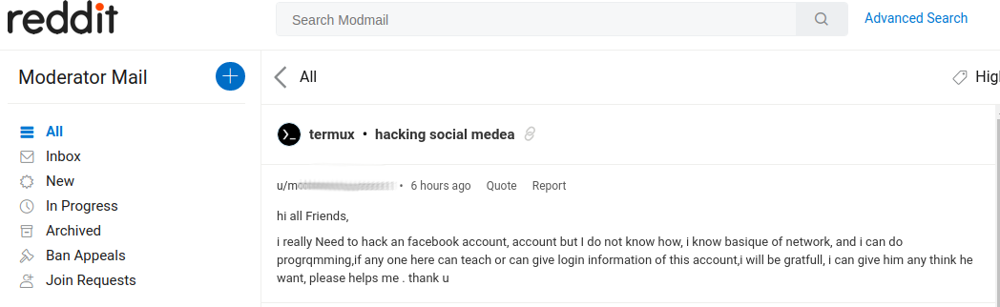

On various Internet resources, Termux is recognized as utility
extremelly helpful for variety of purposes like hacking, phishing and
information gathering. This is possible due to availability of famous
pentesting software like [Metasploit
Framework](https://www.metasploit.com/),
[SQLMAP](https://github.com/sqlmapproject/sqlmap),
[Aircrack-NG](https://www.aircrack-ng.org/), [Nmap](https://nmap.org/)
and many others. Best experience could be achieved by using a rooted
device and [NetHunter](https://www.kali.org/docs/nethunter/) modified
kernel
([Base](https://www.kali.org/docs/nethunter/nethunter-kernel-2-config-1/),
[Net](https://www.kali.org/docs/nethunter/nethunter-kernel-3-config-2/),
[SDR](https://www.kali.org/docs/nethunter/nethunter-kernel-5-config-4/),
[USB](https://www.kali.org/docs/nethunter/nethunter-kernel-6-config-5/),
[Wi-Fi](https://www.kali.org/docs/nethunter/nethunter-kernel-4-config-3/)).

## Why Termux discourages hacking

*Spoiler: that is not about legit use of Termux for authorized
pentesting by security specialists, but rather about community activity
discrediting our project.*

Termux has been created as general-purpose tool suitable for wide range
of use cases. People often use it for task automation via shell
scripting, SSH client, file synchronization and backup, running pocket
web server or development environment. Hacking is just only one of many
possible usage variants.

Unfortunately, the Internet is full of examples of the worst possible
Termux usages targeted on people excessively interested in privacy
violation, fraud, spying or stalking. Many of them are confusing and it
is quite hard to reproduce, especially people who are new to command
line software and scripting. We often getting requests for help on these
topics:

- How to hack Wi-Fi?
- How to hack Facebook?
- How to view private photos of specific Instagram account?
- How to track someone knowing phone number or IP address?
- How to create a web site clone for phishing?
- How to spam with SMS? Which SMS bomber is the best?
- How to install and use Kali Linux?

Obviously, this has nothing to do with legit penetration testing but
correlate with Termux-related information spread on social media. This
just gives no chance to be discover other use cases. Mature communities
of Linux enthusiasts often recognize our project as "script kiddie"
sandbox, rather than a serious project aiming to bring common free and
open source software to Android OS ecosystem. Not saying that this fact
makes troublesome to find qualified contributors to keep the project up.

Now, we have chosen to not participate in this nonsense. We do not
provide hacking tools in our repositories anymore - don't even ask for
them. Several common tools were removed, i.e. Metasploit, Hashcat,
Hydra, SQLMAP. Additionally, we have banned these topics in our
[community social media](Community): Hacking, Phishing,
Spying (including OSINT), Spamming and others describing activity
deliberately violating other person's privacy or is destructive.

## Terminology

**Script kiddie**: a person with poor knowledge in computer systems and
programming, who tries to use pentesting software for impressing friends
or gaining authority in computer enthusiast communities. Script kiddes
are known to often reject educational resources and other kind of help
on improving their skills, especially if learning path takes much time.
They need everything and now, claiming themselves as "newbies".

**Hacker**: a computer expert who uses their technical knowledge to
achieve a goal or overcome an obstacle, within a computerized system by
non-standard means - often referred as "power" or "advanced" users.
Hackers are not necessarily persons who uses their skills to breach
computer system security.

**Hacking**: exploiting weaknesses in computer systems or networks in
order to bypass defenses, gain unauthorized access to data or use
undocumented features and functionality.

**Ethical Hacking**: also known as "Penetration Testing" - a simulated
authorized cyber attack on computer units for evaluating the security
level of given system. All uncovered security issues are reported to the
owner of targeted system.

**White Hat**: a person that does ethical hacking, i.e. attacks system
with owner permission and helps to get rid of discovered security
issues.

**Black Hat**: a person that attacks the computer system without
permission with motive of destruction or personal profit.

**Phishing**: a type of fraudulent activity involving the psychological
manipulation of people to reveal confidential information. Since
phishing exploits the human nature instead of computer system
weaknesses, it cannot be considered as hacking and moreover, it is never
ethical.

**Exploit**: a fragment of data that is used to take advantage of a
software or hardware bug to cause unintended or unanticipated behavior
of computer system, leading to denial of service or attacker's privilege
escalation (e.g. gaining root permissions).

**DoS attack**: an attack causing denial of service through exhausting
computing resources (e.g. network throughput), exploiting software bug
causing abnormal CPU or memory usage or leading to crash of server
software.

**DDoS attack**: a denial-of-service attack performed by multiple
actors, usually by thousands of infected computer systems.

**Spamming**: sending unsolicited content to messaging systems and
social media for the purpose of commercial advertisement, phishing, etc.
Spam has nothing to do with hacking, but it doesn't mean that it is
acceptable activity.

**SMS bombing**: a destructive variant of spam, involving continuous
sending of large amount of SMS messages in a short time.

**Phone call bombing**: same as SMS bombing but with phone calls. Under
certain cases it can be even considered rather as DoS attack than just
spam.

**Brute force**: a way to guess the password by trying every possible
combination of characters, numbers and special symbols. Under perfect
conditions and without time constraints, this attack is almost always
successful. In reality, it is the most expensive way of gaining
unauthorized access as require trade off between consumed computing
resources (energy) and time.

**Root**: also known as Superuser - a special user account that has all
permissions and thus having full control over operating system. On
modern Linux-based systems its privileges are defined through
[capabilities](https://man7.org/linux/man-pages/man7/capabilities.7.html),
which can be revoked or selectively granted to non-root users. More
fine-grained root user permissions control can be achieved through
implementing mandatory access control policies, e.g. via SELinux.

**Rooting**: an activity aiming to gain root privileges on the device.
Can involve exploiting vulnerabilities in operating system, but often
this is done in a "legal" way through installing a custom firmware.

**Custom kernel**: an operating system kernel with extra features
besides bare minimum functionality. As Android typically uses a very
minimal Linux kernel build, in order to add support for custom hardware
you will need to compile your own.

**Monitor mode**: also known as RFMON (Radio Frequency MONitor) - a
functionality of wireless network interface adapter allowing to capture
radio frames. It is known to be either disabled or not implemented at
firmware level for the Wi-Fi adapters built into Android devices.

## How to be a hacker

Just using Kali Linux, especially in a chroot (proot) variants, will not
make you become a hacker automatically. This requires huge amount of
skills, which is not possible to acquire in a few days or weeks. This
takes years. If you are interested in how your roadmap will look like,
check this page: <https://www.wikihow.com/Become-a-Hacker>.

Once you think you are good enough for practice, here is a service for
proving your skills: <https://www.hackthebox.eu/>

By stepping on hacker's road, especially if decided to use Termux for
hacking purposes, you agree that you are on your own. Warranty is lost
at this point. We will not assist you in fixing issues, whether or not
related to your activity. If certain tools do not work or in any other
way malfunctioning, report issues to their distributors or original
authors.

Remember that Termux staff and community are not responsible for all
your hacking troubles, lost data, broken devices and other damage caused
by your usage of Termux.

## How to use Termux safely

Just follow these principles:

- When following a tutorial, make sure that you properly understand the
  goal and every instruction. Understand what commands you are typing
  and what they do.
- Use root permissions only when necessary. Never run everything,
  including current shell, as root.
- Install software only from trusted sources. Remember that even open
  source software can contain trojan functionality.
- If third-party script asks for credentials, most likely it is a scam.
  Obfuscated third-party scripts are likely to be a scam too.
- Suspicious files should be sent to
  [VirusTotal](https://www.virustotal.com/gui/home/upload).
- Do backups regularly, preferably encrypted and stored on at least 2
  hardware disks (HDD, in worst case USB flash stick) and 1 copy on
  cloud.
- Don't think you are very careful and thus bulletproof for scam,
  phishing or trojans. Long random passwords, verified software and
  brain in head are nice, but being prepared to be pwned at some day is
  even better.
- Remember that YouTube tutorials are made for profit and entertainment,
  but not suitable for education.

## Package requests

**We do not accept any requests for hacking packages.** Please do not
submit them because such requests will be deleted.

If you are interested in maintaining a repository of pentesting or
phishing packages, please do it on your own. We encourage community to
create own repositories with custom content rather than solely relying
on us and our services. Hacking package repositories are not eligible to
become "official" anyway.

## External resources

- [Top 10 Web Application Security
  Risks](https://owasp.org/www-project-top-ten/)
- [Hack The Box - pentester's playground](https://www.hackthebox.eu/)
- [Courses by Offensive
  Security](https://www.offensive-security.com/courses-and-certifications/)

## Tags

0day, abuse, account, adminfinder, aircrack-ng, aireplay-ng, airgeddon,
airodump-ng, andrax, androspy, anonymous, apt2, arp poisoning, b11, b3x,
b4bomber, backdoor, badmod, beef, black-hydra, blazy, bluespy, bomber,
brutal, brute, bruteforce, brutex, bully, burp suite, call, catphish,
cloner, combogen, combos, cowpatty, crack, cracking, credmap, cyberscan,
d00r, dark-fb, darkfly, ddos, decompile, deface, demozz, devploit,
disassemble, discord, dmitry, dsniff, eagleeye, easy_hack, eggshell,
email, evilginx, exploit, exploitdb, eyewitness, facebook, faraday,
findsploit, firefly, flood, followers, free, fsociety, genvirus, gmail,
goldeneye, grabber, h4ck, hack, hacker, hacklock, hakkuframework,
hashcat, hemera, hidden eye, i2p, infect, infoga, insta-bf, instagram,
instahack, intercept, ipdrone, ip-tracer, johntheripper, kali linux,
kalimux, katanaframework, kismet, krack, lazybee, lazymux, lazysqlmap,
lazy-termux, lucifer, maltego, malware, maskphish, masscan, mbomb, mdk3,
mdk4, metasploit, meterpreter, mitm, mitmproxy, morpheus, mrphish, msf,
netattack, nethunter, netscan, nexphisher, nikto, nmap, nmbf, onex,
osif, osint, oxidtools, parrot os, password, paybag, payload,
pentesting, phishing, phoneinfoga, ping, powersploit, pwn, pyrit,
rainbow tables, rang3r, rat, ravana, reaver, recovery, red hawk, root,
routersploit, rpcscan, saycheese, setoolkit, shellcode, shellnoob,
shodan, skipfish, slowloris, sms, sms bomber, sn1per, socialbox,
socialfish, spam, spammer, spazsms, spy, sql injection, sqlmap,
sqlninja, sslstrip, striker, tbomb, telegram, th3inspector, thc-hydra,
thc-ipv6, thebond, the-eye, thefatrat, theharvester, tool-x, tor,
trojan, udp flood, umbrella, virus, vpn, vulnerability, vulnscan,
vulscan, webscarab, websploit, webspoilt, weeman, wep, whatsapp, wi-fi,
wifi, wifibrutecrack, wifigod, wifi-hacker, wifiphisher, wifitap wifite,
wirespy, wordlist, wpa2, wpa3, wps, wpscan, xerxes, xss, xsser,
xsstrike, youtube, zirikatu, zphisher.