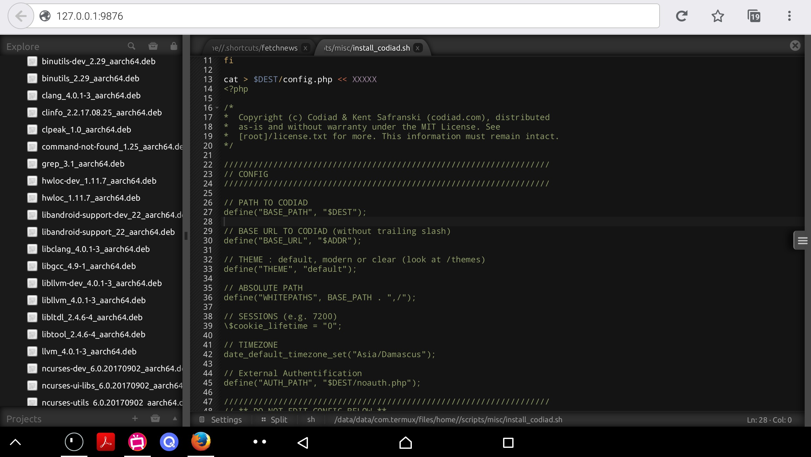
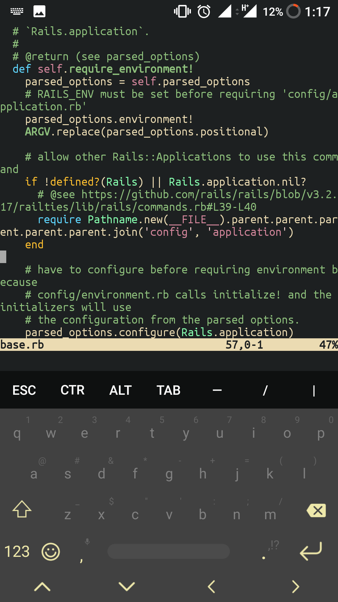

An integrated development environment (IDE) is a software application
that provides comprehensive facilities to computer programmers for
software development. An IDE normally consists of at least a source code
editor, build automation tools and a debugger.

# Codiad

[Codiad Web IDE](https://github.com/Codiad/Codiad) Codiad is a web-based
IDE framework with a small footprint and minimal requirements.

Codiad was built with simplicity in mind, allowing for fast, interactive
development without the massive overhead of some of the larger desktop
editors. That being said even users of IDE's such as Eclipse, NetBeans
and Aptana are finding Codiad's simplicity to be a huge benefit. While
simplicity was key, we didn't skimp on features and have a team of
dedicated developer actively adding more.

Rnauber has created a script for installing the web-based IDE/editor
codiad locally:

`   bash <(wget -qO- `[`https://gist.githubusercontent.com/rnauber/9f579d1480db4cc5a9a3c97c00c52fb9/raw/install_codiad.sh`](https://gist.githubusercontent.com/rnauber/9f579d1480db4cc5a9a3c97c00c52fb9/raw/install_codiad.sh)` )`

# Emacs

Package: emacs

Description: An extensible, customizable, free/libre text editor — and
more.

Homepage: <https://www.gnu.org/software/emacs/>

# Vim

Package: vim

Description: Vim - the ubiquitous text editor

Homepage: <http://www.vim.org/>

# See Also

- [Editors](Editors)