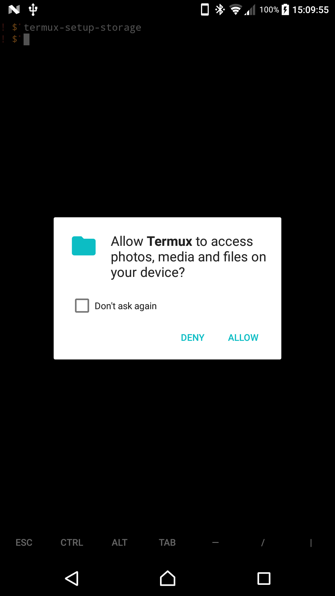
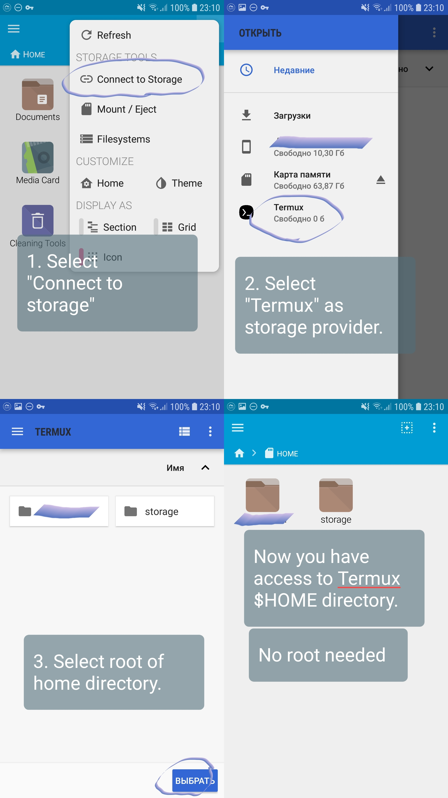

There are three main types of storage in Termux:

1.  Internal storage: files put in \$HOME, available from inside Termux
    or when explictly picked in a SAF-compatible file manager.
2.  Shared storage: general purpose file storage available for the all
    applications. You need to grant Termux storage access permission to
    use it.
3.  External storage: external SD cards or USB hard drives. Typically
    read-only, except the Termux private directory.

See below for detailed feature comparison between storage types:

| Storage type               | chmod/chown support | Special files support | Executables support | Access mode       |
|----------------------------|---------------------|-----------------------|---------------------|-------------------|
| Internal (\$HOME/\$PREFIX) | yes                 | yes                   | yes                 | RW (app dir)      |
| Shared storage             | no                  | no                    | no                  | RW                |
| External storage           | no                  | no                    | no                  | RO / RW (app dir) |

Full read-write access to external SD cards and USB drives is available
only on rooted devices. *For those who are curious why some applications
can write on external storage without restriction: these applications
use a special APIs (Storage Access Framework) not available for command
line applications.*

Shared storage as well as external storage is not suitable for
installing software. Do not even try to move Termux directories like
\$HOME or \$PREFIX onto this kind of storage. Such option is only
available for advanced users who have rooted device and are familiar
with customization of partitions and file system on their external
storage. Use of adoptable storage will not make your external SD card
compatible with Termux, it is effectively same as shared storage
(EXT4/F2FS with FAT32/exFAT compatible overlay).

After creating directory `Android/data/com.termux`, through file manager
or by `termux-setup-storage`, you can access your external SD directly
in this folder. The remainder of the external SD card will not be
accessable from Termux unless you grant storage permission for Termux in
Android. **Important:** Please remember that if you uninstall Termux app
this directory will be deleted!

# Access shared and external storage

To access shared and external storage you need to run
`termux-setup-storage`. You will then be prompted to "Allow Termux
access photos, media and files on your device", which you should allow.

Executing termux-setup-storage ensures:

1.  That permission to shared storage is granted to Termux when running
    on Android 6.0 or later.
2.  That an app-private folder on external storage is created (if
    external storage exists).
3.  That a folder \$HOME/storage is created.

If you have Termux:API application and `termux-api` package installed,
you can use Android file picker to get any file from either shared or
external storage by using utility `termux-storage-get`. Example:

`termux-storage-get filename.txt`

File that has been chosen through file picker will be saved as
"filename.txt".

# \~/storage

The contents of the created \$HOME/storage folder are symlinks to
different storage folders:

- The root of the shared storage between all apps.

`~/storage/shared`

- The standard directory for downloads from e.g. the system browser.

`~/storage/downloads`

- The traditional location for pictures and videos when mounting the
  device as a camera.

`~/storage/dcim`

- Standard directory in which to place pictures that are available to
  the user.

`~/storage/pictures`

- Standard directory in which to place any audio files that should be in
  the regular list of music for the user.

`~/storage/music`

- Standard directory in which to place movies that are available to the
  user.

`~/storage/movies`

- Symlink to a Termux-private folder on external storage (only if
  external storage is available).

`~/storage/external-1`

**Important**: do not clear Termux application data through Android OS
Settings if you have any files placed to `~/storage/external-1`. If you
do so, all data will be lost as Android will wipe all directories
associated with Termux.

# Access Termux from a file manager

You can access Termux home directory (\$HOME) from the file manager
using Storage Access Framework and capable of accessing drives like USB
or external SD-card in read-write mode.

Few recommended file managers which can access Termux home directory:

- FX File Explorer:
  <https://play.google.com/store/apps/details?id=nextapp.fx>
- Material Files:
  <https://play.google.com/store/apps/details?id=me.zhanghai.android.files>

Steps to enable access to \$HOME are same as for any external drives:
open storage manager --\> select drive (Termux) --\> Select root
directory of storage.

You may use the following command to launch Android internal file
manager which also allows to transfer files between Termux and other
storage volumes:

`am start -a android.intent.action.VIEW -d "`[`content://com.android.externalstorage.documents/root/primary`](content://com.android.externalstorage.documents/root/primary)`"`

And you can also start the
\[<https://github.com/termux/termux-app/tree/master/app/src/main/java/com/termux/filepicker>\|
Termux Filepicker\] too:

`am start -a android.intent.action.OPEN_DOCUMENT -d /storage/emulated/0 -t '*/*'`

Alternate way would be direct access to Termux home directory with
Superuser permissions. That's possible only on rooted devices. However,
using root to work with Termux files is not recommended way as you can
easily mess up file access modes and SELinux contexts.