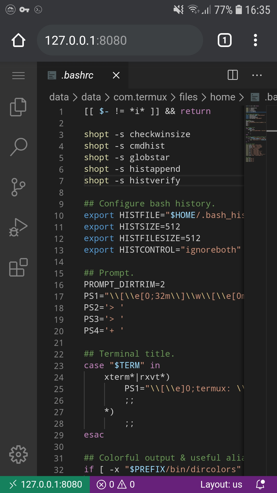

Node.js is an open-source, cross-platform, JavaScript runtime
environment that executes JavaScript code outside a web browser. Node.js
lets developers use JavaScript to write command line tools and for
server-side scripting—running scripts server-side to produce dynamic web
page content before the page is sent to the user's web browser.

In Termux Node.js is available in current and LTS versions which can be
installed by

`pkg install nodejs`
`pkg install nodejs-lts`

Only one of versions can be installed at a time.

**Due to our infrastructure limits, we do not provide older versions of
packages. If you accidentally upgraded to unsuitable NodeJS or
NodeJS-LTS version and do not have backups to rollback, do not complain!
We recommend doing backups of \$PREFIX for developers and other people
who rely on specific software versions.**

## Package management

After installing Node.js, `npm` package manager will be available. Here
is a quick tutorial about its usage.

Installing a new package globally:

`npm install -g {package name}`

Uninstall package installed globally:

`npm uninstall -g {package name}`

List packages installed globally:

`npm list -g`

If you working with Node.js packages project-wide, i.e. they should not
be installed into \$PREFIX, then remove command line argument `-g`.

In addition to `npm`, a Yarn package manager can be used as well. You
can install it with

`pkg install yarn`

When installing Node.js packages, it is highly recommended to have a
Termux packages `build-essential` and `python` to be installed - they
are needed for building native extensions.

## Node.js package installation tips and tricks

It is assumed that you have `build-essential` and `python` already
installed. Some modules may require `binutils` to be installed, as they
unable to pick LLVM utilities (e.g. llvm-ar) for some reason.

*Tip: help us to collect more information about installing Node.js
packages in Termux. You can also help to keep this information
up-to-date, because current instructions may eventually become
obsolete.*

<table>
<thead>
<tr class="header">
<th>
Package
</th>
<th>
Description
</th>
<th>
Dependencies
</th>
<th>
Special Instructions
</th>
</tr>
</thead>
<tbody>
<tr class="odd">
<td>
code-server
</td>
<td>
VS Code IDE in a web browser. 
<a
href="https://github.com/cdr/code-server">https://github.com/cdr/code-server</a>
</td>
<td>
yarn
</td>
<td>
<code>yarn global add code-server</code>
</td>
</tr>
</tbody>
</table>