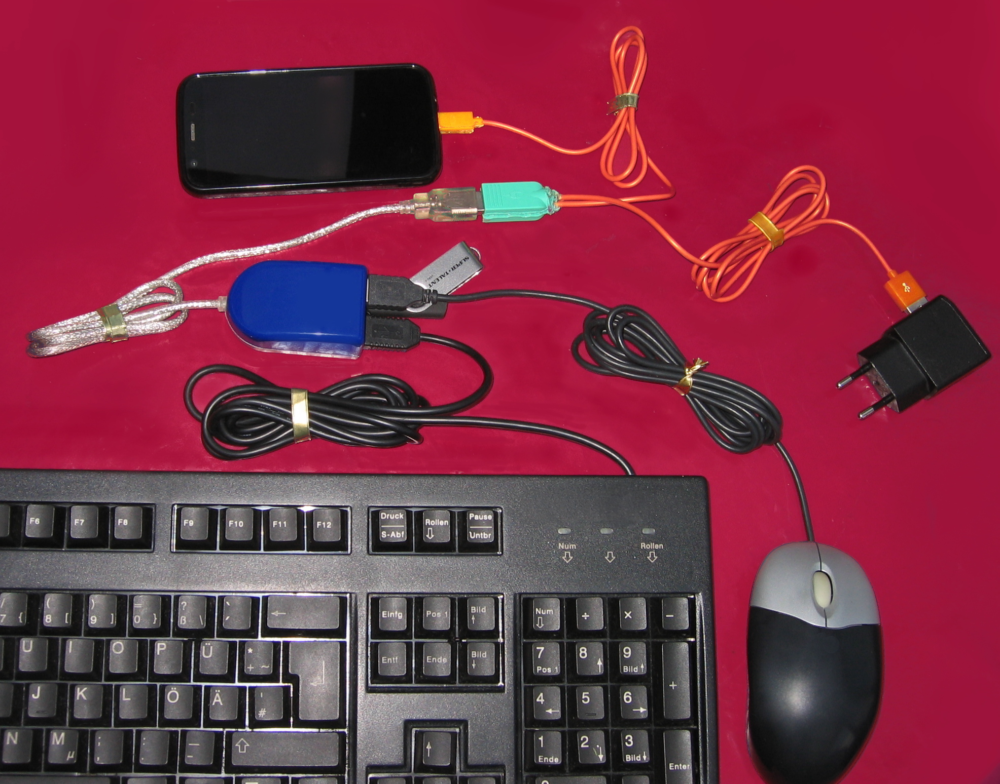

USB On-The-Go, often abbreviated to USB OTG or just OTG, is a
specification first used in late 2001 that allows USB devices, such as
tablets or smartphones, to act as a host, allowing other USB devices,
such as USB flash drives, digital cameras,
[mice](Hardware_Mouse) or
[keyboards](Hardware_Keyboard), to be attached to them. Use
of USB OTG allows those devices to switch back and forth between the
roles of host and device. For instance, a mobile phone may read from
removable media as the host device, but present itself as a USB Mass
Storage Device when connected to a host computer.

# See Also

- [Hardware Keyboard](Hardware_Keyboard)
- [Hardware Mouse](Hardware_Mouse)
- [OTG issues at Termux
  Packages.](https://github.com/termux/termux-packages/issues?utf8=%E2%9C%93&q=OTG)