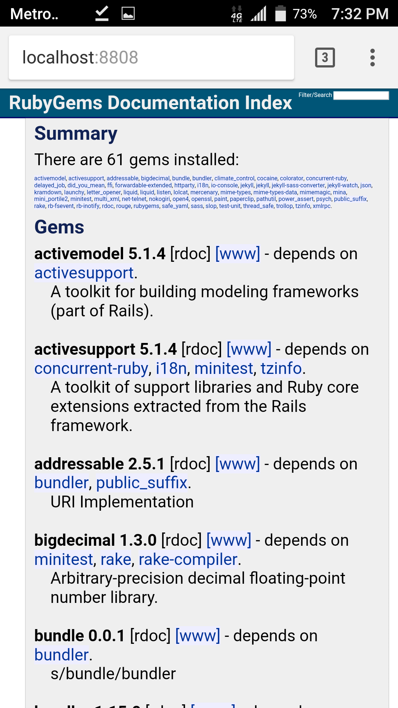

Ruby is a dynamic, open source programming language with a focus on
simplicity and productivity. It has an elegant syntax that is natural to
read and easy to write.

In Termux Ruby can be installed by executing

`pkg install ruby`

**Due to our infrastructure limits, we do not provide older versions of
packages. If you accidentally upgraded to unsuitable Ruby version and do
not have backups to rollback, do not complain! We recommend doing
backups of \$PREFIX for developers and other people who rely on specific
software versions.**

## Package management

After installing ruby, `gem` package manager will be available. Here is
a quick tutorial about its usage.

Installing a new gem:

`gem install {package_name}`</code>

Uninstalling gem:

`gem uninstall {package name}`

Listing installed gems:

`gem list --local`

Launching a local documentation and gem repository server:

`gem server`

When installing Ruby gems, it is highly recommended to have a package
`build-essential` to be installed - some gems compile native extensions
during their installation.

## Gem installation tips and tricks

*Tip: help us to collect more information about installing Ruby gems in
Termux. You can also help to keep this information up-to-date, because
current instructions may eventually become obsolete.*

| Package       | Description                                                                                                       | Dependencies                | Special Instructions                           |
|---------------|-------------------------------------------------------------------------------------------------------------------|-----------------------------|------------------------------------------------|
| delayed_job   | Database based asynchronous priority <https://github.com/collectiveidea/delayed_job>                              |                             |                                                |
| ffi           | A gem for loading dynamically-linked native libraries, binding functions within them <https://github.com/ffi/ffi> |                             |                                                |
| jekyll        | Tool for creating static websites <https://github.com/jekyll/jekyll>                                              | ruby clang make libffi      |                                                |
| letter_opener | Preview mail in the browser instead of sending <https://github.com/ryanb/letter_opener>                           |                             |                                                |
| lolcat        | Prints rainbow colored text <https://github.com/busyloop/lolcat>                                                  |                             |                                                |
| mina          | Blazing fast application deployment tool <https://github.com/mina-deploy/mina>                                    |                             |                                                |
| nokogiri      | XML and HTML library <https://github.com/sparklemotion/nokogiri>                                                  | libxslt libiconv pkg-config | gem install nokogiri -- --use-system-libraries |
| paperclip     | Easy file attachment management for ActiveRecord <https://github.com/thoughtbot/paperclip>                        |                             |                                                |
| thin          | A very fast & simple Ruby web server <https://github.com/macournoyer/thin>                                        | ruby make                   | gem install thin -- --use-system-libraries     |