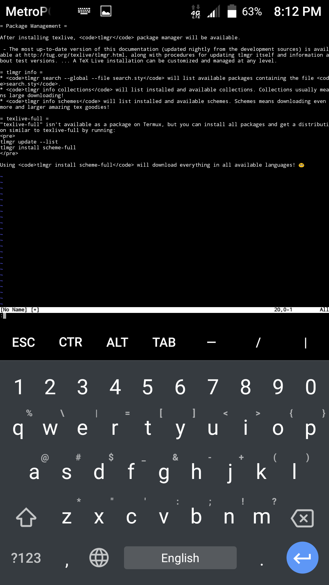

Texlive can be installed through the package `texlive-installer`. The
package contains `termux-install-tl`, a wrapper around texlive's own
install-tl script.

Texlive for termux needs several patches to work with termux's non
standard filesystem. There is a risk that updates through tlmgr break
our texlive since they might undo the various applied patches. If
texlive breaks after an update you can run `termux-patch-texlive` to
(try to) apply the patches again.

When installing through termux-install-tl you cannot customize
everything, changing installation path or trying to use binaries from
upstream will break texlive.

# TeX Live Package Management

Texlive packages can be inatalled through texlive's package manager
tlmgr.

The most up-to-date version of tlmgr documentation (updated nightly from
the development sources) is available at
<http://tug.org/texlive/tlmgr.html>, along with procedures for updating
tlmgr itself and information about test versions. A Texlive installation
can be customized and managed at any level.

## tlmgr info

- `tlmgr search --global --file search.sty` will list available packages
  containing the file `search.sty`.
- `tlmgr info collections` will list installed and available
  collections. Collections usually means large downloading!
- `tlmgr info schemes` will list installed and available schemes.
  Schemes means downloading even more and larger amazing tex goodies!

## tlmgr install

Single packages can be installed with

` tlmgr install `<package>

## tlmgr update

Updating all install texlive packages can be done

` tlmgr update --all`

# Details on how texlive-installer works

`texlive-installer` installs two scripts that can be run,
`termux-install-tl` and `termux-patch-texlive`.

`termux-install-tl` runs a patched variant (some paths needs to be
changed) of upstream's install-tl script with an argument
(`-custom-bin`) pointing to the binaries that have been installed with
`texlive-bin`. If you want to run the installer with other arguments,
for example `-repository` pointing to a local mirror, you can run
`termux-install-tl -repository path/to/mirror`. You are then shown a
text gui where you have the opportunity to choose which schemes you want
to install. After all texlive packages have been downloaded and
installed `termux-patch-texlive` is run to fix known problems, mostly to
change paths (`/tmp` -\> `$PREFIX/tmp` and similar).

If you at a later point run `tlmgr update` and end up with a
none-working texlive you might be able to fix the problems by running
`termux-patch-texlive`.