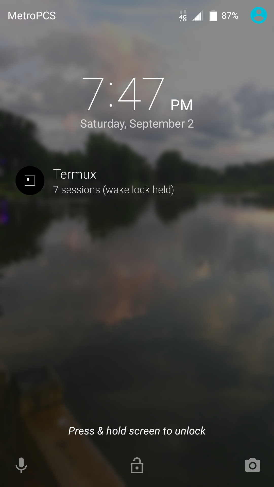

`termux-wake-lock` and `termux-wake-unlock` can be used to trigger a
wakelock which causes Android not to go into deep sleep.

Since the default login shell is bash; it could be useful to call
`termux-wake-lock` in your \~/.profile (or \~/.bash_profile where
appropriate) and `termux-wake-unlock` in your \~/.bash_logout; for
single session usage. For multiple sessions, you'll have to manage the
unlock call yourself. But it is an option to call bash once and use
`byobu` to get a multiple bash session running within a single termux
session.
