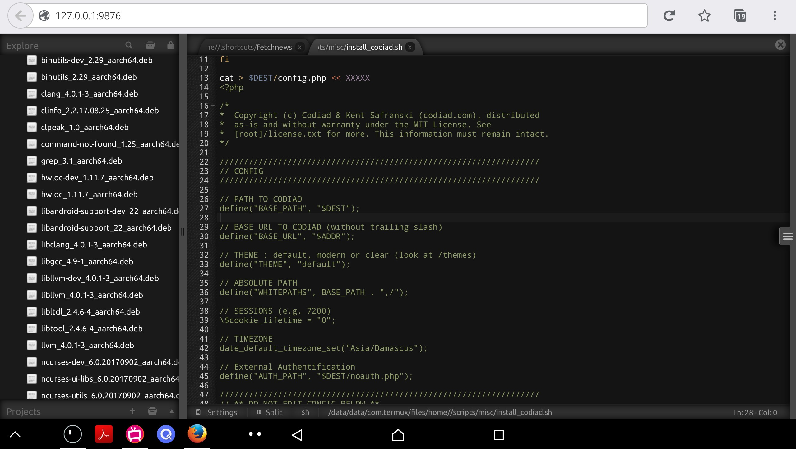
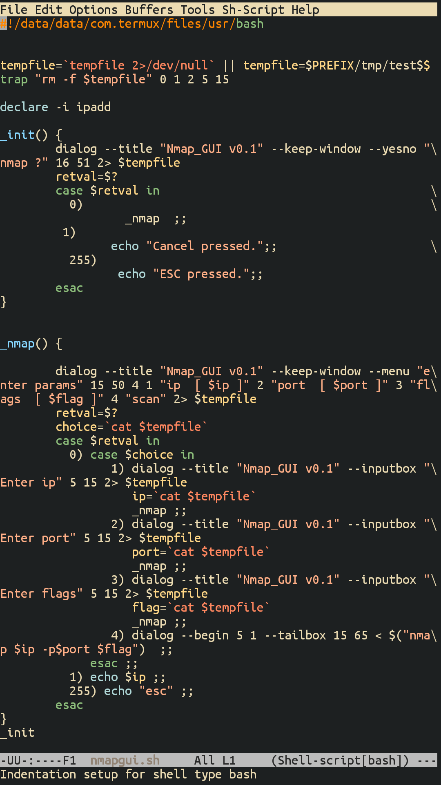

A system or program that allows a user to edit text. A text editor is a
type of program used for editing plain text files.

Text editors are provided with operating systems and software
development packages, and can be used to change configuration files,
documentation files and programming language source code.

# Codiad

[Codiad Web IDE](https://github.com/Codiad/Codiad) Codiad is a web-based
IDE framework with a small footprint and minimal requirements.

Codiad was built with simplicity in mind, allowing for fast, interactive
development without the massive overhead of some of the larger desktop
editors. That being said even users of IDE's such as Eclipse, NetBeans
and Aptana are finding Codiad's simplicity to be a huge benefit. While
simplicity was key, we didn't skimp on features and have a team of
dedicated developer actively adding more.

Rnauber has created a
[script](https://gist.githubusercontent.com/rnauber/9f579d1480db4cc5a9a3c97c00c52fb9/raw/install_codiad.sh)
for installing the web-based IDE/editor codiad locally:

# Emacs

GNU Emacs is a free, portable, extensible text editor. See
[emacstutor](emacstutor).

Package: emacs

Description: Extensible, customizable text editor-and more

Homepage: <https://www.gnu.org/software/emacs/>

You can install emacs by `pkg install emacs`

# joe

Wordstar like text editor

Homepage: <http://joe-editor.sourceforge.net>

# jupp

user friendly full screen text editor

Homepage: <https://www.mirbsd.org/jupp.htm>

# Micro

Micro is a terminal-based text editor that aims to be easy to use and
intuitive, while also taking advantage of the full capabilities of
modern terminals. It comes as one single, batteries-included, static
binary with no dependencies.

As the name indicates, micro aims to be somewhat of a successor to the
nano editor by being easy to install and use in a pinch, but micro also
aims to be enjoyable to use full time, whether you work in the terminal
because you prefer it (like me), or because you need to (over ssh).

Use `pkg install micro` to install it.

# nano

nano is a small and friendly editor. It copies the look and feel of
Pico, but is free software, and implements several features that Pico
lacks, such as: opening multiple files, scrolling per line, undo/redo,
syntax coloring, line numbering, and soft-wrapping overlong lines.

You can install it using `pkg install nano`

# ne

Easy-to-use and powerful text editor

Homepage: <http://ne.di.unimi.it/>

# sed

GNU stream text editor

Homepage: <https://www.gnu.org/software/sed/>

# Vim

In `vi` after `apt install vim`, or `vim` type the following `:help`
+enter/return to get started. To find more about the help system in vim
type the following `:help help` +enter/return. For FAQs about vim, key
in `:help faq`. If you want to learn how to use Vim you can tun
[vimtutor](vimtutor) at the command prompt.

Package: vim

Description: Vi IMproved - enhanced vi editor

Homepage: <https://www.vim.org/>

You can install vim by `pkg install vim`

## Neovim

Neovim is an extension of Vim: feature-parity and backwards
compatibility are high priorities. Neovim is a refactor, and sometimes
redactor, in the tradition of Vim (which itself derives from Stevie). It
is not a rewrite but a continuation and extension of Vim. Many clones
and derivatives exist, some very clever—but none are Vim. Neovim is
built for users who want the good parts of Vim, and more.

Install : `$ pkg install neovim`

Homepage: <https://neovim.io>

# zile

 Lightweight
clone of the Emacs text editor

Homepage: <https://www.gnu.org/software/zile/>

# See Also

- [IDEs](IDEs)
