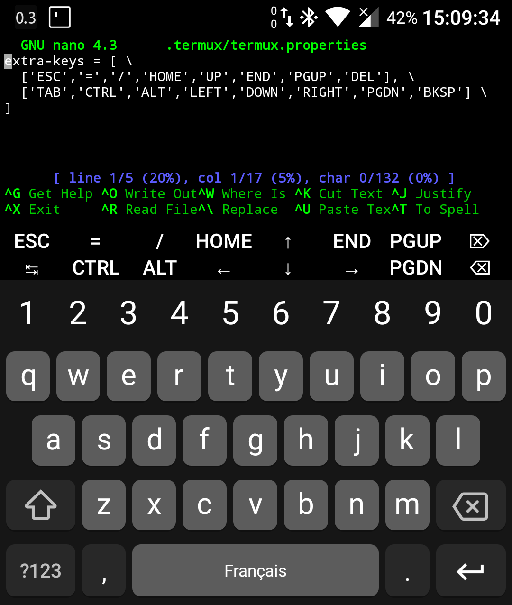
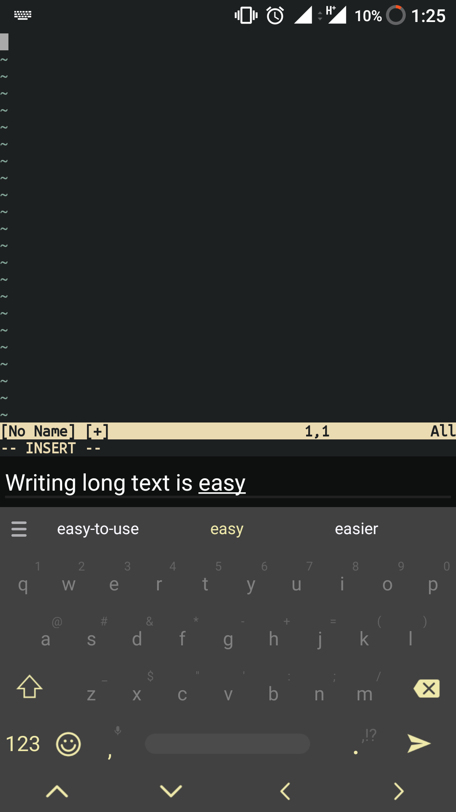

Use of keys like Alt, Ctrl, Esc is necessary for working with a
[CLI](CLI) terminal. Termux touch keyboards do not include
one. For that purpose, Termux uses the Volume down button to emulate the
Ctrl key. For example, pressing `Volume down+L` on a touch keyboard
sends the same input as pressing `Ctrl+L` on a hardware keyboard.

The result of using Ctrl in combination with a key depends on which
program is used, but for many command line tools the following shortcuts
works:

- **Ctrl+A** → Move cursor to the beginning of line
- **Ctrl+C** → Abort (send SIGINT to) current process
- **Ctrl+D** → Logout of a terminal session
- **Ctrl+E** → Move cursor to the end of line
- **Ctrl+K** → Delete from cursor to the end of line
- **Ctrl+U** → Delete from cursor to the beginning of line
- **Ctrl+L** → Clear the terminal
- **Ctrl+Z** → Suspend (send SIGTSTP to) current process
- **Ctrl+W** → Clear prompt before word (a word is a set of characters
  after a space)
- **Ctrl+alt+C** → Open new session (only works in Hacker's Keyboard)

The Volume up key also serves as a special key to produce certain input:

- **Volume Up+E** → Escape key
- **Volume Up+T** → Tab key
- **Volume Up+1** → F1 (and Volume Up+2 → F2, etc)
- **Volume Up+0** → F10
- **Volume Up+B** → Alt+B, back a word when using readline
- **Volume Up+F** → Alt+F, forward a word when using readline
- **Volume Up+X** → Alt+X
- **Volume Up+W** → Up arrow key
- **Volume Up+A** → Left arrow key
- **Volume Up+S** → Down arrow key
- **Volume Up+D** → Right arrow key
- **Volume Up+L** → \| (the pipe character)
- **Volume Up+H** → \~ (the tilde character)
- **Volume Up+U** → _ (underscore)
- **Volume Up+P** → Page Up
- **Volume Up+N** → Page Down
- **Volume Up+.** → Ctrl+\\ (SIGQUIT)
- **Volume Up+V** → Show the volume control
- **Volume Up+Q** → Show extra keys view
- **Volume Up+K** → Another variant to toggle extra keys view

# Extra Keys Row

Termux also has an extra keys view which allows you to extend your
current keyboard. To enable the extra keys view you have to long tap on
the keyboard button in the left drawer menu. You can also press Volume
Up+Q or Volume Up+K.

After Termux v0.66 extra keys row became configurable through file
"\~/.termux/termux.properties". If this file does not exist, you will
need to create it.

After editing Termux.properties file, you need to reload Termux
configuration by executing command "termux-reload-settings".

The setting extra-keys-style can be used to choose which set of symbols
to use for the keys. Valid options are "default," "arrows-only",
"arrows-all", "all" and "none".

`extra-keys-style = default `

Example configuration to enable 2-row (was in v0.65) extra keys:

`extra-keys = [['ESC','/','-','HOME','UP','END','PGUP'],['TAB','CTRL','ALT','LEFT','DOWN','RIGHT','PGDN'|'ESC','/','-','HOME','UP','END','PGUP'],['TAB','CTRL','ALT','LEFT','DOWN','RIGHT','PGDN']]`

The extra-keys definition itself can also be spread over multiple lines,
if desired, by "backslash-escaping" the line feed at the end of each
line, thus:

`extra-keys = [ \`
` ['ESC','|','/','HOME','UP','END','PGUP','DEL'], \`
` ['TAB','CTRL','ALT','LEFT','DOWN','RIGHT','PGDN','BKSP'] \`
`]`

## Supported keys

Each key "entry" can be either a string (such as `'|'`, `'/'` or `'='`)
or one of the values listed below. These values are defined in
ExtraKeysView.java, and the list of values (not including possible
synonyms) is:

- CTRL ("special key")
- ALT ("special key")
- FN ("special key")
- SHIFT ("special key")
- SCROLL
- SPACE
- ESC
- TAB
- HOME
- END
- PGUP
- PGDN
- INS
- DEL
- BKSP
- UP
- LEFT
- RIGHT
- DOWN
- ENTER
- BACKSLASH
- QUOTE
- APOSTROPHE
- F1, F2, F3, F4, F5, F6, F7, F8, F9, F10, F11, F12
- KEYBOARD (Hide the keyboard)
- DRAWER (Open app drawer)

Each of the three "special keys" listed above should only be listed at
most ONCE in the extra-keys definition i.e. do NOT have more than one
CTRL key. Having more than one instance of any "special key" will result
in a bug whereby those keys do not function correctly.

A note about backslash: this character has special meaning and you
shouldn't use it directly to define a key. Use 'BACKSLASH' instead,
otherwise properly escape it - `'\\\\'`.

## Advanced extra keys configuration

In Termux v0.95 extra keys configuration was extended with configurable
popups. Popups keys can be triggered by swiping up on the respective
keys.

Here is a syntax for key definition with popup:

`{key: KEY, popup: POPUP_KEY}`

and here is a syntax for a more advanced key:

`{key: KEY, popup: {macro: 'KEY COMBINATION', display: 'Key combo'}}`

Example of advanced extra keys configuration:

    extra-keys = [[ \
      {key: ESC, popup: {macro: "CTRL d", display: "tmux exit"}}, \
      {key: CTRL, popup: {macro: "CTRL f BKSP", display: "tmux ←"}}, \
      {key: ALT, popup: {macro: "CTRL f TAB", display: "tmux →"}}, \
      {key: TAB, popup: {macro: "ALT a", display: A-a}}, \
      {key: LEFT, popup: HOME}, \
      {key: DOWN, popup: PGDN}, \
      {key: UP, popup: PGUP}, \
      {key: RIGHT, popup: END}, \
      {macro: "ALT j", display: A-j, popup: {macro: "ALT g", display: A-g}}, \
      {key: KEYBOARD, popup: {macro: "CTRL d", display: exit}} \
    ]]

# Text Input View

Terminal emulators usually do not support the advanced features of touch
keyboards like autocorrect, prediction and swipe typing. To solve this,
Termux has a text input view. Text entered in it will get pasted to the
terminal. Because it's a native Android text input view, all touch
keyboard features will work. To access the text input view you have to
swipe the extra keys view to the left.

# See Also

- [Hardware Keyboard](Hardware_Keyboard)
- [Hardware Mouse](Hardware_Mouse)