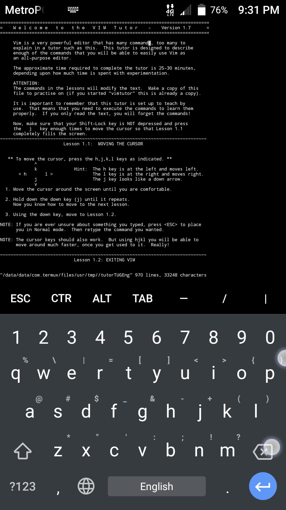

This tutor is designed to describe enough of the commands that you will
be able to easily use Vim as an all-purpose editor.

The approximate time required to complete the tutor is 25-30 minutes,
depending upon how much time is spent with experimentation.

After `apt install vim`, type `vimtutor` at the Termux command prompt
+enter/return to get started.

# See Also

[Tutorials](Tutorials)