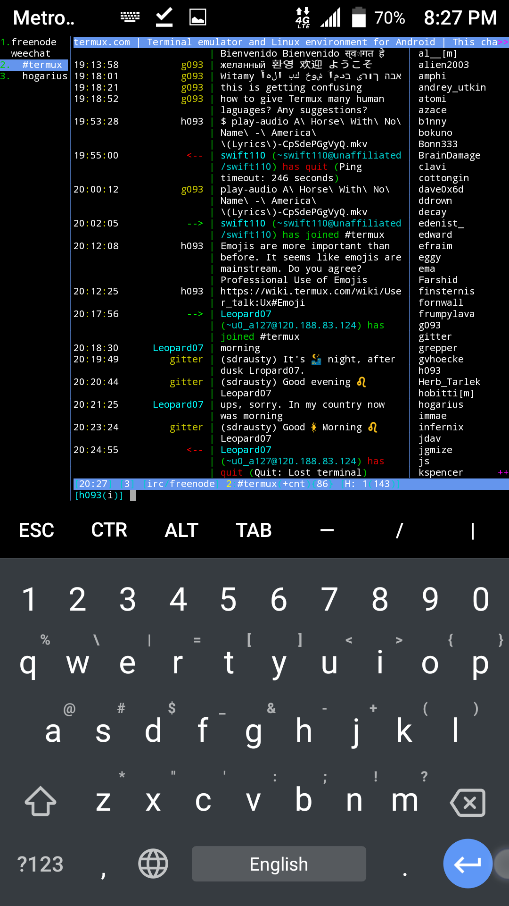

WeeChat is a fast, light and extensible chat client. It runs on many
platforms like Linux, Unix, BSD, GNU Hurd, Mac OS X and Windows
(Bash/Ubuntu and Cygwin).

WeeChat is: modular: a lightweight core with optional plugins
multi-protocols architecture (mainly IRC) extensible with C, Python,
Perl, Ruby, Lua, Tcl, Scheme and Javascript fully documented and
translated into several languages a free program released under the
GPLv3 license an active project with a large community for scripts.

WeeChat has modules:

weechat-lua-plugin: WeeChat Lua Plugin
weechat-perl-plugin: WeeChat Perl Plugin
weechat-python-plugin: WeeChat Python3 Plugin
weechat-ruby-plugin: WeeChat Ruby Plugin

# Installation

`pkg install weechat`

Refer weechat
[guide](https://weechat.org/files/doc/stable/weechat_quickstart.en.html)
for more help

## See also

- [ERC](Emacs#ERC)
- [IRC](IRC)
- [Irssi](Irssi)