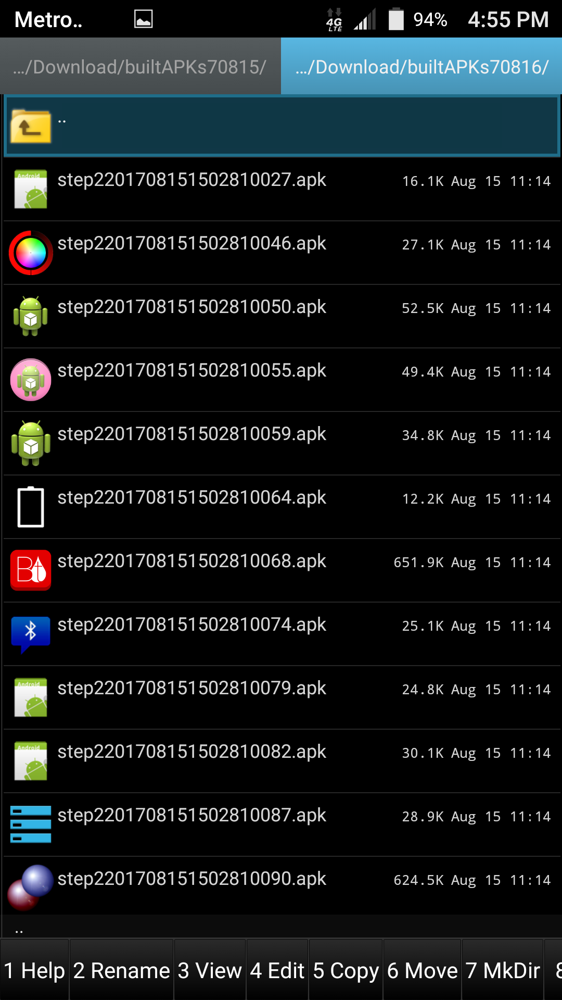

Have you ever wanted to build your own Android application created on a
smartphone and tablet? Now you can easily compile many selected
applications that have already been successfully built, installed and
tested in [Termux](https://github.com/termux) on device. You can copy
and paste the following into Termux in order to install
[BuildAPKs](https://github.com/BuildAPKs) on device:

       pkg install curl

       curl -O https://raw.githubusercontent.com/BuildAPKs/buildAPKs/master/setup.buildAPKs.bash

       bash setup.buildAPKs.bash

[Scripts in these
directories](https://github.com/BuildAPKs/buildAPKs/tree/master/scripts/)
can build thousands of APKs on device with Termux in an Amazon and
Android smartphone, tablet, TV and Chromebook. You can use the BASH
scripts located
[here](https://github.com/BuildAPKs/buildAPKs/tree/master/scripts/bash/build)
to start building APKs on device.

The
[build.github.bash](https://raw.githubusercontent.com/BuildAPKs/buildAPKs.github/master/build.github.bash)
bash script works directly with the GitHub API. To see how this script
queries the api for data you can use \` grep curl
\~/buildAPKs/build.github.bash \` once BuildAPKs is installed. This
command:

    ~/buildAPKs/build.github.bash BuildAPKs

shall attempt to build all the Android Package Kits
[BuildAPKs](https://github.com/BuildAPKs?tab=repositories) has to offer.

The [db.BuildAPKs repository](https://github.com/BuildAPKs/db.BuildAPKs)
assits in parsing repositories for AndroidManifest.xml files located at
GitHub. The \~/buildAPKs/opt/db/[BNAMES
file](https://github.com/BuildAPKs/db.BuildAPKs/blob/master/BNAMES)
holds built APK statistics: GitHub login, date stamp, repository
projects download size, build time, the number of AndroidManifest.xml
files found and how many APKs were successfully built on device for each
login that successfully built at least one APK on device from Github
with BuildAPKs.

You can build Android browsers and file managers in Termux by issuing
the `build.browsers.bash` command once
[BuildAPKs](https://github.com/BuildAPKs) is installed.

# See Also

- [Ant](Ant)
- [Development Environments](Development_Environments)
- [Editors](Editors)
- [Gradle](Gradle)
- [IDEs](IDEs)
